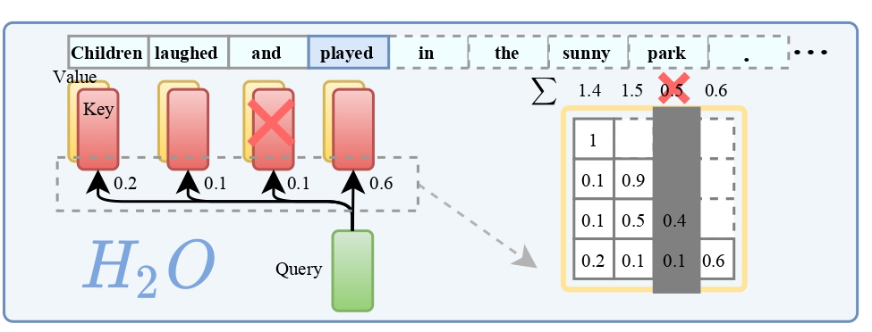

# H2O: Heavy-Hitter Oracle for Efficient Generative Inference of Large Language Models

Code for the paper "**H2O: Heavy-Hitter Oracle for Efficient Generative Inference of Large Language Models**"

Zhenyu Zhang, Ying Sheng, Tianyi Zhou, Tianlong Chen, Lianmin Zheng, Ruisi Cai, Zhao Song, Yuandong Tian, Christopher Ré, Clark Barrett, Zhangyang Wang, Beidi Chen

## Overview

Large Language Models (LLMs), despite their recent impressive accomplishments, are notably cost prohibitive to deploy, particularly for applications involving long-content generation, such as dialogue
systems and story writing. Often, a large amount of transient state information, referred to as the KV
cache, is stored in GPU memory in addition to model parameters, scaling linearly with the sequence
length and batch size. In this paper, we introduce a novel approach for implementing the KV cache which
significantly reduces its memory footprint. Our approach is based on the noteworthy observation that a
small portion of tokens contributes most of the value when computing attention scores. We call these
tokens Heavy Hitters (H2). Through a comprehensive investigation, we find that (i) the emergence of H2
is natural and strongly correlates with the frequent co-occurrence of tokens in the text, and (ii) removing
them results in significant performance degradation. Based on these insights, we propose Heavy Hitter
Oracle (H2O), a KV cache eviction policy that dynamically retains a balance of recent and H2 tokens. We
formulate the KV cache eviction as a dynamic submodular problem and prove (under mild assumptions)
a theoretical guarantee for our novel eviction algorithm which could help guide future work. We validate
the accuracy of our algorithm with OPT, LLaMA, and GPT-NeoX across a wide range of tasks. Our
implementation of H2O with 20% heavy hitters improves the throughput over three leading inference
systems DeepSpeed Zero-Inference, Hugging Face Accelerate, and FlexGen by up to 29×, 29×, and 3×
on OPT-6.7B and OPT-30B. With the same batch size, H2O can reduce the latency by up to 1.9×.

## Content

We provide two code to implement heavy-hitter oracle for efficient generative inference of large language models:

	- [h2o_flexgen](h2o_flexgen/README.md): Archieving higher throughput for LLM generation, the code is based on [FlexGen](https://github.com/FMInference/FlexGen). 
	- [h2o_hf](h2o_hf): Testing the performance on different benchmarks, the code is based on [Hugging Face](https://github.com/huggingface/transformers). And we plan to work on the real throughput improvment based on Hugging Face framework.
